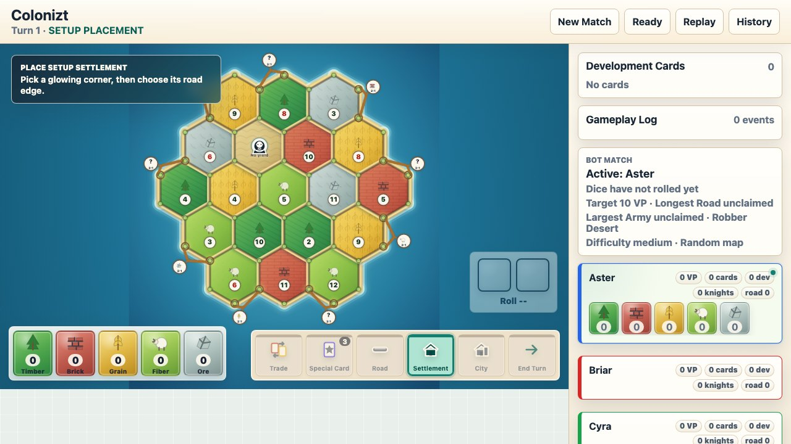
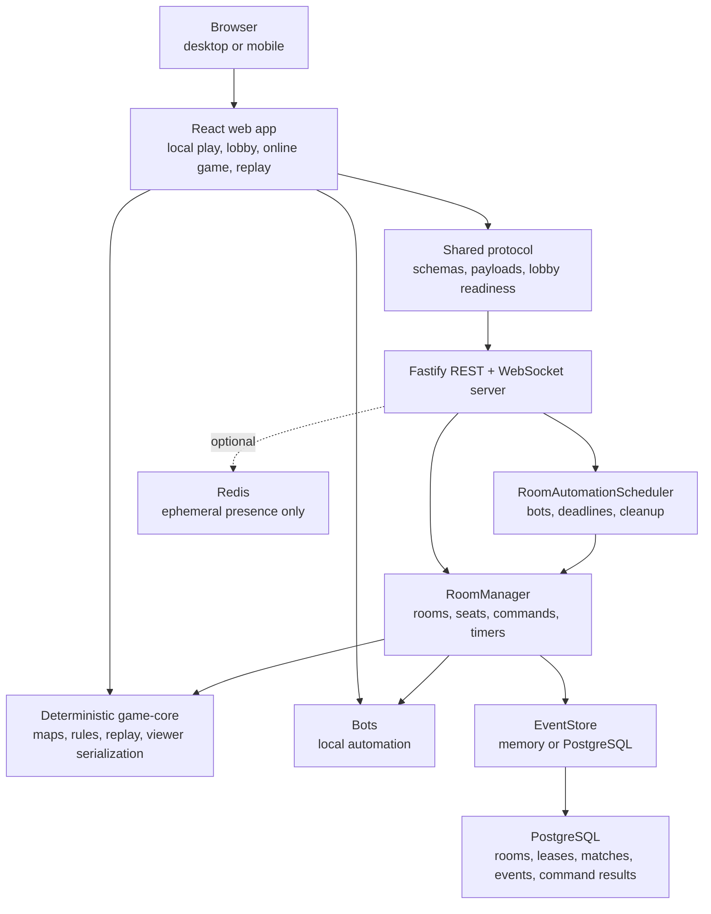

# Colonizt

Colonizt is an original browser-first, real-time resource trading and route building board-game prototype. It focuses on the engineering problems behind a multiplayer board game: deterministic rules, server-authoritative commands, WebSocket room state, replayable event logs, bot simulations, reconnect/resync, mobile-friendly UI, and production-shaped deployment.

This project is a portfolio and interview-preparation codebase. It does not copy Colonist/CATAN branding, art, proprietary UI, wording, or assets; related product research notes stay outside the published app.



## What It Does

- Runs local bot matches directly in the browser and hosted player matches through a server-authoritative room.
- Supports deterministic replay, match history, reconnect/resync, invite links, room codes, and spectator/replay views.
- Implements classic-like board mechanics including setup placement, roads, settlements, cities, development cards, thief/robber movement, discard-on-7, Longest Road, and Largest Army.
- Includes bots, simulations, property tests, deployed smoke checks, and regression tests for gameplay, network, UI, and liveness behavior.
- Persists room/replay truth in PostgreSQL when configured; Redis is optional and used only for ephemeral presence/fanout.

## Tech Stack

- **Language/runtime:** TypeScript, Node.js 22, npm workspaces, project references.
- **Frontend:** React 19, Vite, SVG board renderer, CSS, Playwright browser tests.
- **Backend:** Fastify, `@fastify/websocket`, REST + WebSocket room protocol.
- **Rules engine:** Pure deterministic `@colonizt/game-core` commands, events, serialization, replay, and simulations.
- **Protocol:** Shared Zod schemas in `@colonizt/protocol` for REST/WebSocket payload validation.
- **Persistence:** PostgreSQL via `pg` and forward-only migrations in `@colonizt/db`.
- **Presence/fanout:** In-memory by default, optional Redis adapter for ephemeral socket presence.
- **Quality gates:** Vitest, fast-check property tests, Playwright, Stryker mutation testing, ESLint, TypeScript, dependency audit, CodeQL, Docker, GitHub Actions, SonarCloud.
- **Deployment:** Docker images for server/web, Nginx static web runtime, Caddy reverse proxy snippets for OCI colocated deployment.

## Quick Start

Prerequisites:

- Node.js 22+
- npm 11+
- Docker, if you want PostgreSQL/Redis locally

```bash
npm install
cp .env.example .env
docker compose up -d postgres
npm run dev
```

Local URLs:

- Web app: `http://127.0.0.1:5173`
- API/WebSocket server: `http://127.0.0.1:8787`

Redis is optional. Start it with `docker compose up -d redis` and keep `REDIS_URL` in `.env` if you want to exercise the Redis-backed presence adapter.

For a browser-only local bot match, the web workspace can run by itself:

```bash
npm --workspace @colonizt/web run dev -- --host 127.0.0.1
```

## Useful Commands

| Command | Purpose |
| --- | --- |
| `npm run dev` | Run web and server dev processes together. |
| `npm run lint` | Run ESLint across the workspace. |
| `npm run typecheck` | Run TypeScript project-reference checks. |
| `npm run test:unit` | Test pure engine, bots, demo state, and test utilities. |
| `npm run test:property` | Run random legal-game invariant/property checks. |
| `npm run test:integration` | Test server, WebSocket, event-store, room, and route behavior. |
| `npm --workspace @colonizt/web run test` | Run React/web unit tests. |
| `npm run test:e2e` | Run Playwright browser tests. |
| `npm run test:multiplayer` | Run a real local two-browser create/join/start/reconnect/resync journey. |
| `npm run test:coverage` | Enforce 95% statement coverage, 95.5% line/function coverage, and 85% branch coverage. |
| `npm run test:mutation` | Mutation-test replay, invariants, room lifecycle, and command idempotency. |
| `npm run smoke:network` | Start a real local API/WSS flow and verify four clients plus reconnect/resync. |
| `npm run load:sockets:soak` | Run the thresholded 20-room WebSocket reconnect/load soak. |
| `npm run replay:fixtures` | Rebuild known replay fixtures from stored event logs. |
| `npm run build` | Typecheck and build the production web bundle. |
| `npm run verify:local` | Run the main local verification gate. |

Bot simulation gates are also available:

```bash
npm run simulate:bots:gate
npm run simulate:bots:default-lineup
npm run simulate:bots:difficulty
```

## Repository Structure

```text
packages/
  game-core/    Deterministic board model, rules engine, commands, events, scoring, replay.
  protocol/     Shared REST/WebSocket Zod schemas and public payload types.
  server/       Fastify REST API, WebSocket gateway, rooms, sessions, automation, observability.
  web/          React app, SVG board, local/network play, replay controls, sounds, mobile UI.
  db/           PostgreSQL migrations and persistence helpers.
  bots/         Bot candidate generation, heuristics, trade evaluation, and decision sampling.
  demo-state/   Browser/local demo game setup and local automation helpers.
  test-utils/   Shared fixtures, bot-game runners, and test helpers.

scripts/        Smoke tests, replay fixtures, simulations, load scripts, docs checks.
docs/           Architecture, API, deployment, testing, replay format, roadmap, review notes.
deploy/         OCI compose files and production environment examples.
ops/            Caddy/Nginx config and OCI deploy/smoke scripts.
.github/        CI/CD, SonarCloud, and pull request templates.
```

## Architecture

Colonizt keeps match truth in one authoritative runtime per active room. The browser sends commands through REST/WebSocket interfaces; the server validates them, commits accepted events, broadcasts room-local updates, and can rebuild state from replay logs.



Current production mode is intentionally single-node authoritative room ownership. PostgreSQL is replay truth; Redis is never match truth.

## Configuration

Copy `.env.example` to `.env` for local development.

| Variable | Notes |
| --- | --- |
| `DATABASE_URL` | PostgreSQL connection string for migrations, rooms, matches, command results, and replay events. |
| `REDIS_URL` | Optional ephemeral presence/fanout adapter. Omit for the in-memory adapter. |
| `SERVER_HOST` / `SERVER_PORT` | Server bind address and port. Use `0.0.0.0` in containers. |
| `WEB_ORIGIN` | Allowed browser origin for CORS and WebSocket origin checks. |
| `INSTANCE_MODE` | Keep `single` until ownership/fanout work is complete. |
| `NODE_ID` | Optional identifier surfaced in health, config, logs, and metrics. |

The browser reads runtime network settings from `GET /config`; production web images should not require rebuilds for every host change.

## Production-Style Run

```bash
docker compose -f docker-compose.yml -f docker-compose.prod.yml up --build postgres server web
```

This starts PostgreSQL, the server on `http://127.0.0.1:8787`, and the static web container on `http://127.0.0.1:8080`.

Deployment details live in [docs/deployment.md](docs/deployment.md). The preferred production path is the `Deploy Production` GitHub Actions workflow: it waits for CI, SonarCloud, and the GHCR image build, promotes the full SHA-tagged images to OCI, then runs deployed network and browser smokes.

The local OCI script remains an emergency fallback and uses immutable GHCR image tags:

```bash
./ops/scripts/deploy-oci.sh <server-ip> <full-40-character-git-sha-image-tag>
./ops/scripts/smoke-oci.sh
```

## Testing and Release Gates

The main PR gate is:

```bash
npm run docs:diagrams
npm run lint
npm run typecheck
npm run test:unit
npm run test:property
npm run test:integration
npm --workspace @colonizt/web run test
npm run simulate:bots:gate
npm run smoke:network
```

Before deploy, also run:

```bash
npm run build
npm run test:e2e -- --project=chromium
npm run test:e2e -- --project=mobile
npm run replay:fixtures
npm run load:sockets
```

Post-deploy smoke checks:

```bash
PUBLIC_API_URL=https://... \
PUBLIC_WS_URL=wss://... \
PUBLIC_WEB_ORIGIN=https://... \
npm run smoke:deployed-network

PUBLIC_WEB_URL=https://... npm run smoke:deployed-browser
```

See [docs/testing.md](docs/testing.md) for the full matrix, including PostgreSQL opt-in tests and cross-network smoke guidance.

## Documentation Map

- [docs/architecture.md](docs/architecture.md): system diagrams and package boundaries.
- [docs/api.md](docs/api.md): REST/WebSocket protocol overview.
- [docs/replay-format.md](docs/replay-format.md): deterministic replay and viewer-safe event serialization.
- [docs/deployment.md](docs/deployment.md): environment variables, Docker/OCI deployment, health checks, operations notes.
- [docs/testing.md](docs/testing.md): verification strategy, smoke tests, and release gates.
- [docs/next-improvements.md](docs/next-improvements.md): current roadmap and risk-driven follow-up work.
- [docs/bot-trade-and-rules.md](docs/bot-trade-and-rules.md): bot trade behavior and optional rule toggles.

## Project Status

Colonizt is a working prototype, not a polished commercial game. The codebase is intentionally broad because the goal is to demonstrate product engineering depth: gameplay correctness, multiplayer reliability, deterministic recovery, automated testing, operations, security posture, and maintainable package boundaries.

No open-source license has been declared yet.
