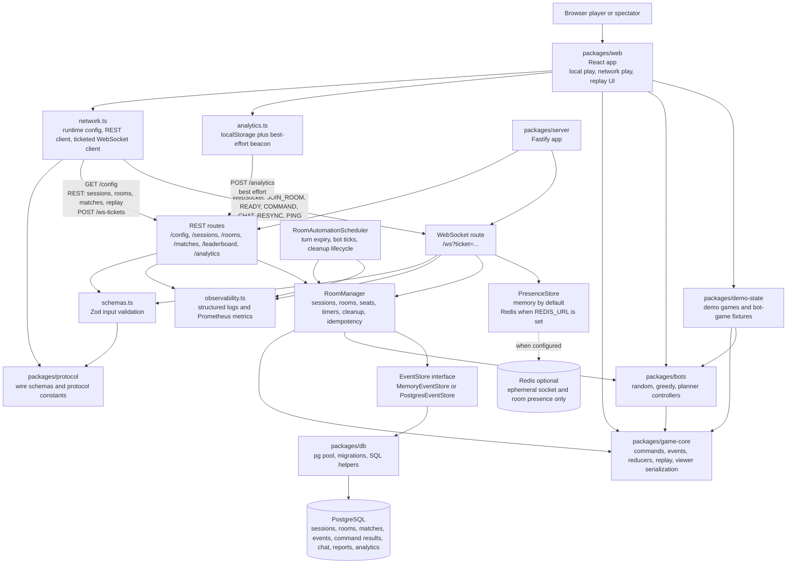
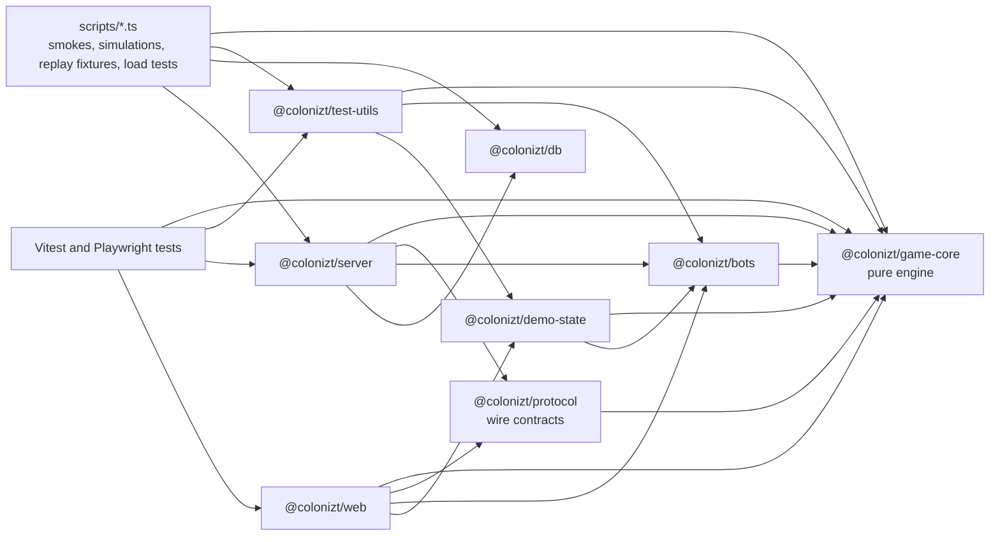
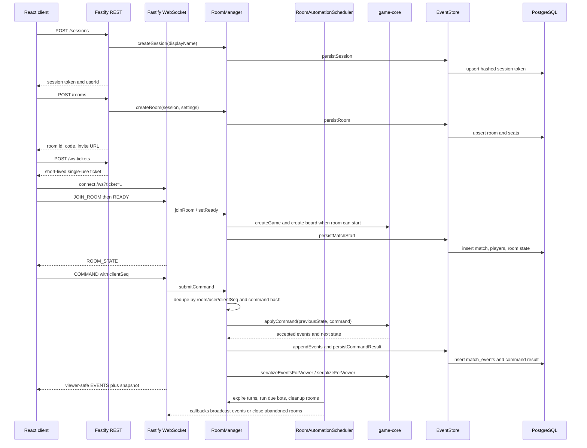
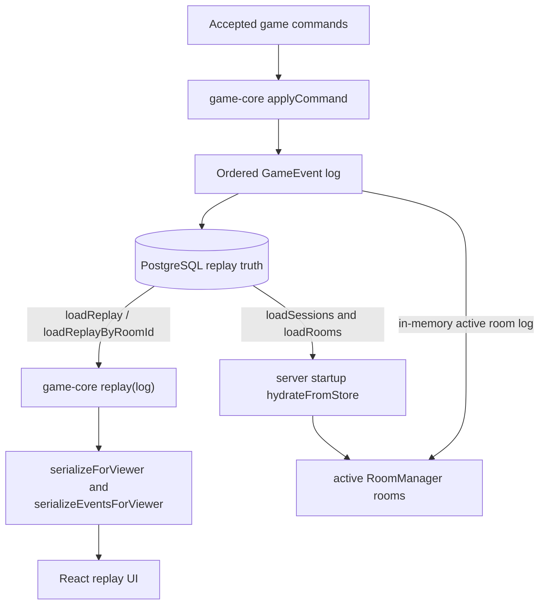
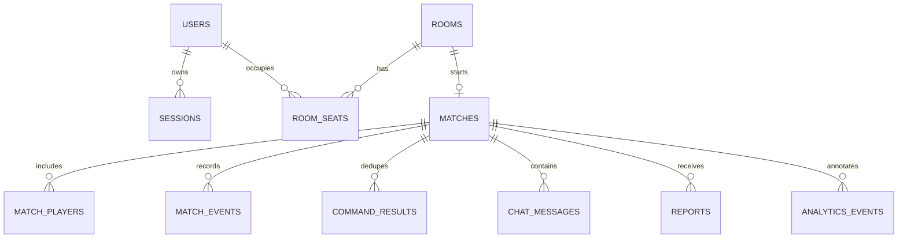
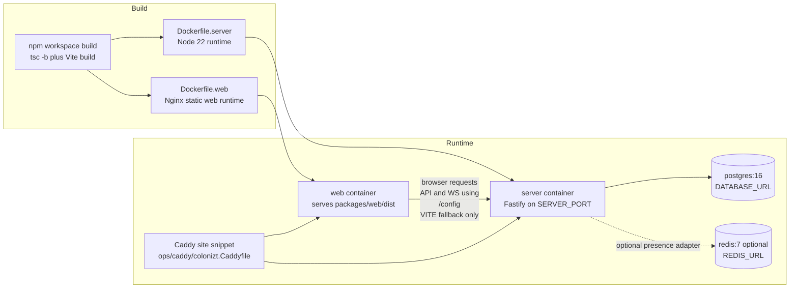

# Architecture

Colonizt is a TypeScript npm workspace for a browser-first multiplayer board game. The main split is:

- `packages/game-core`: pure deterministic domain model.
- `packages/protocol`: shared REST/WebSocket schemas, protocol constants, and public payload types.
- `packages/server`: Fastify REST and WebSocket gateway plus authoritative room orchestration.
- `packages/web`: React/Vite client for local play, network play, and replay viewing.
- `packages/db`: PostgreSQL migrations and persistence helpers.
- `packages/bots`, `packages/demo-state`, and `packages/test-utils`: reusable automation, fixtures, and simulations.

## Runtime Topology

## Package Dependencies

`game-core` is the domain dependency root. It imports only local pure modules and has no React, HTTP, WebSocket, database, filesystem, wall-clock, or ambient-randomness dependencies. `protocol` depends on `game-core` for public payload types and owns the shared wire schemas used by server validation and client network code.

## Authoritative Command Flow

Rejected commands are persisted with their `clientSeq` and command hash when the backing store supports command results. Replayed duplicate commands return `COMMAND_ACK`; conflicting reuse of the same sequence returns `CLIENT_SEQ_CONFLICT`.

## Replay And Recovery

PostgreSQL is durable match truth when `DATABASE_URL` is configured. The server runs migrations on startup, hydrates recent sessions and rooms, and reconstructs room game state from persisted config, board, and events. Snapshots and active room state are conveniences; ordered events remain the replay source of truth.

## Persistence Model

The migrations in `packages/db/migrations` define the concrete schema. `PostgresEventStore` is the server adapter that translates room/session/match operations into the SQL helpers exported from `@colonizt/db`. `MemoryEventStore` implements the same interface for tests and no-database local runs.

## Deployment Shape

Local production-style compose starts PostgreSQL, the Fastify server, and the static web build. Redis is optional and must not be treated as authoritative match history. `INSTANCE_MODE` must be `single`; horizontal scaling active rooms would need sticky sessions or room routing because active room authority currently lives inside one `RoomManager` instance.

## Boundary Notes

- The browser can run a complete local game because `packages/web` imports `game-core`, `bots`, and `demo-state`; network rooms still use the server as the authority.
- The server accepts player intent as commands and broadcasts only accepted, viewer-safe events and snapshots.
- `RoomManager` owns authoritative room state: seats, spectators, pause/resume, chat, reports, command idempotency, and persistence decisions.
- `RoomAutomationScheduler` owns recurring work: turn expiry, due bot actions, and room cleanup callbacks.
- `observability.ts` owns structured logs, metrics counters, and the enforced single-node instance-mode guard.
- `PresenceStore` tracks sockets and room membership only. The memory adapter is default; the Redis adapter is optional and ephemeral.
- `packages/db` knows PostgreSQL tables but does not know Fastify, WebSocket sockets, React, or game rules.
- `packages/test-utils` re-exports bots and demo state so tests and scripts can build deterministic scenarios without depending on the UI or server internals.
