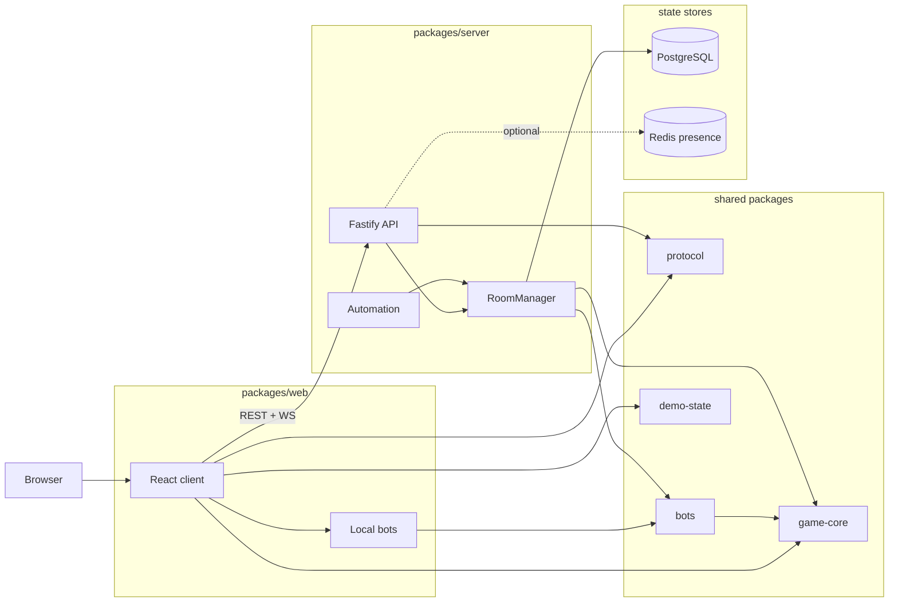
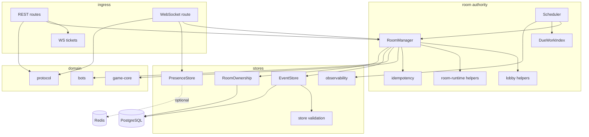
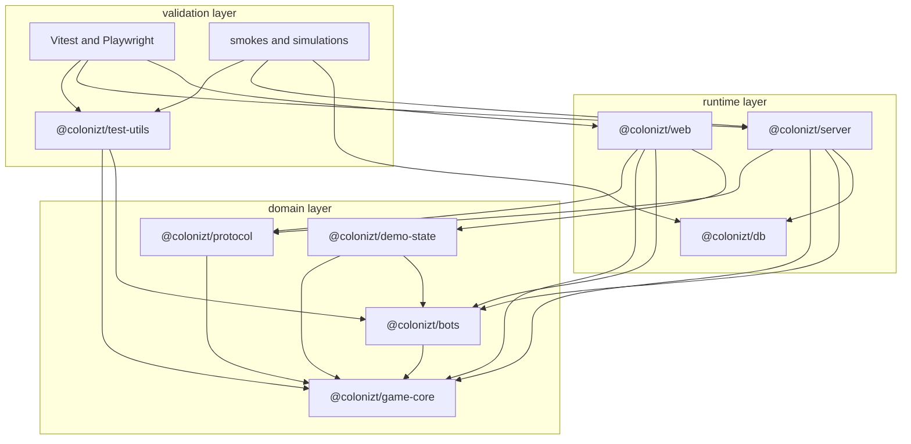
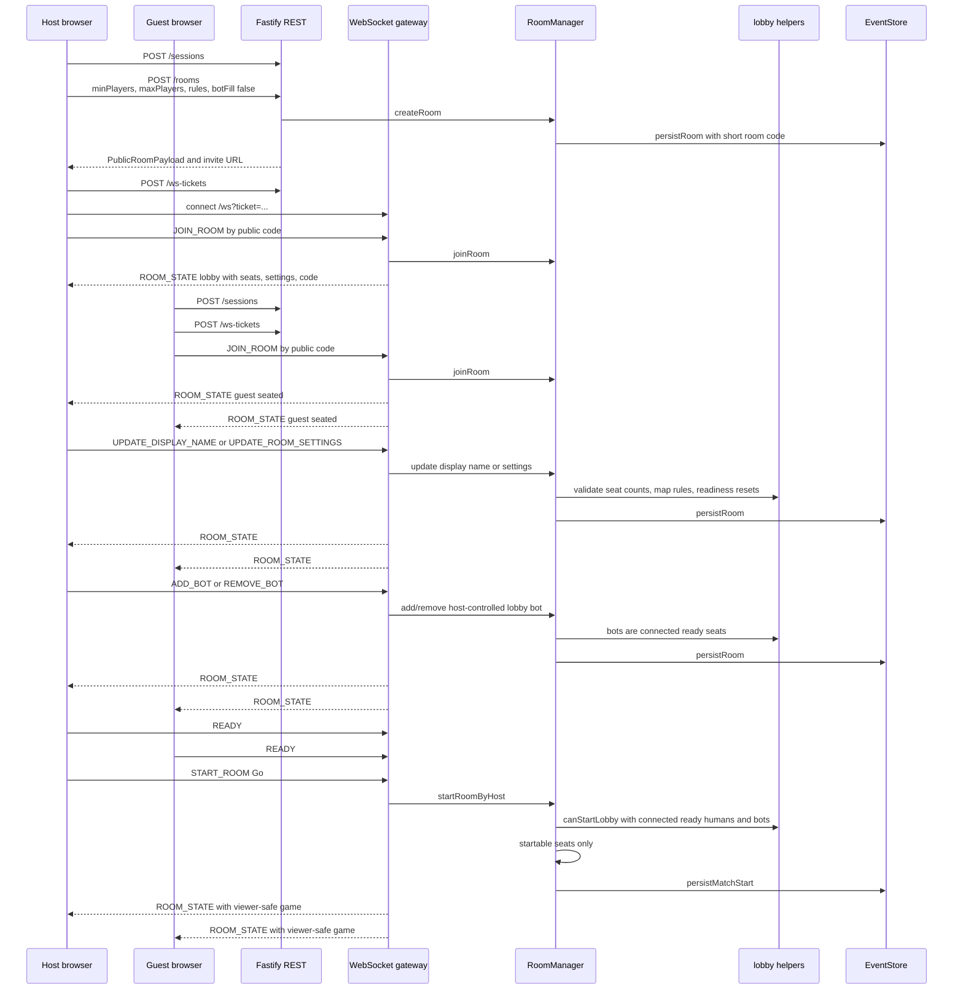
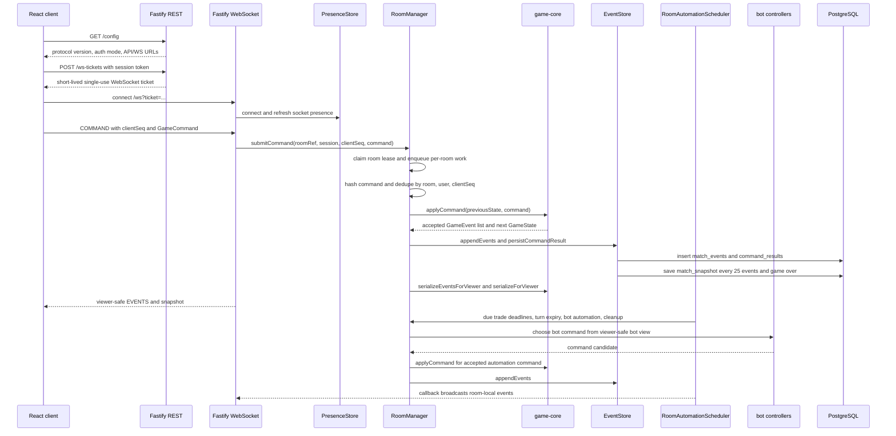
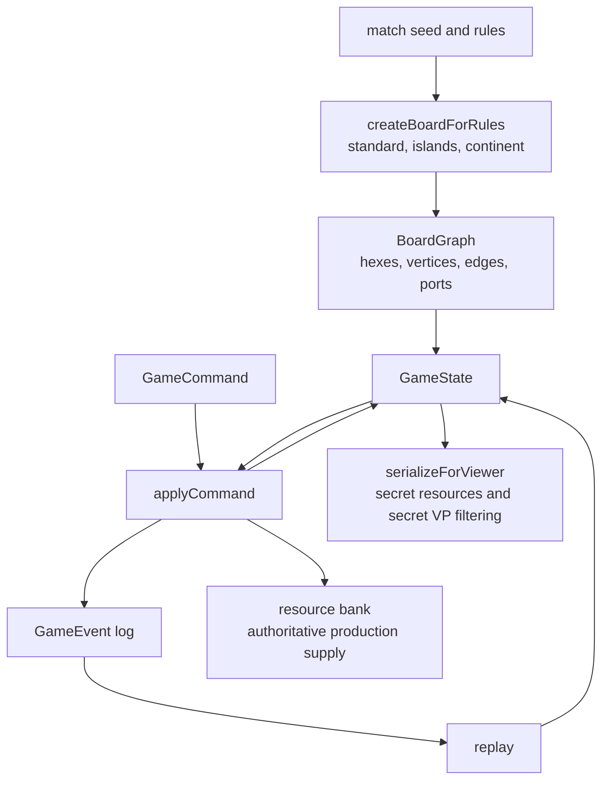
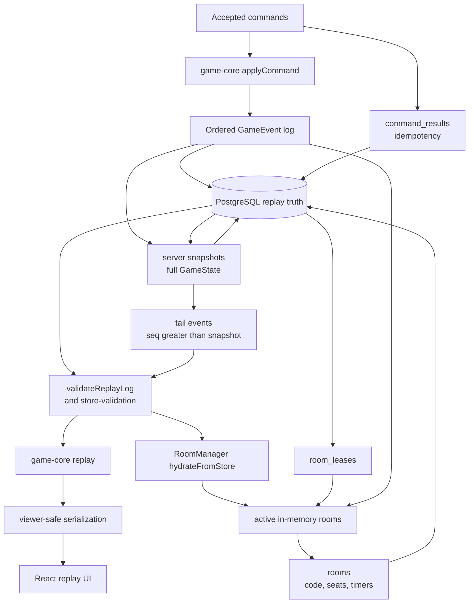
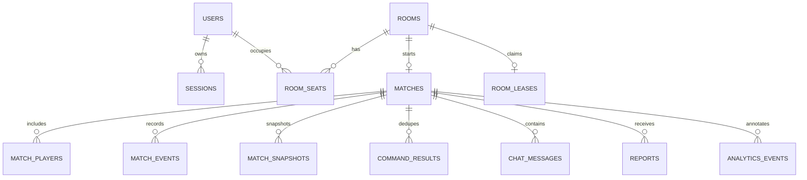
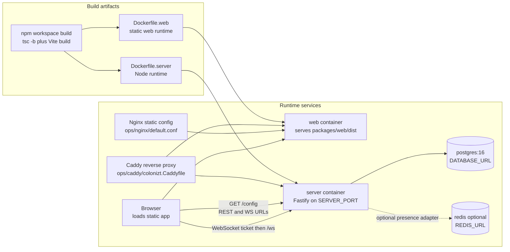

# Architecture

Colonizt is a TypeScript npm workspace for a browser-first multiplayer board game. The current architecture keeps the deterministic game rules independent from UI, transport, persistence, and bot scheduling, while the server owns online room authority.

The main packages are:

- `packages/game-core`: pure deterministic domain model, board/map generation, commands, events, reducers, replay, resource bank rules, and viewer-safe serialization.
- `packages/protocol`: shared REST/WebSocket Zod schemas, protocol constants, public payload types, and lobby readiness helpers used by both server and web.
- `packages/server`: Fastify REST and WebSocket gateway, authoritative room orchestration, lobby state, command idempotency, automation, presence, observability, and persistence adapters.
- `packages/web`: React/Vite client for local bot play, online lobby/gameplay, replay-after-game-over viewing, mobile UI, sounds, and local automation.
- `packages/db`: PostgreSQL migrations and SQL helpers for sessions, rooms, leases, matches, events, command results, chat, reports, analytics, and leaderboard data.
- `packages/bots`, `packages/demo-state`, and `packages/test-utils`: bot controllers, local/demo fixtures, deterministic scenario runners, and test helpers.

## Runtime Topology

This top-level diagram is intentionally coarse. The detailed module relationships are split below so generated Mermaid images stay readable instead of routing every edge through one dense canvas.

## Web Client Detail

```mermaid
flowchart TB
  app["App controller"]

  subgraph ui["UI components"]
    lobbyScreen["Lobby screen"]
    boardUi["Board HUD and overlays"]
    actionDock["Action dock"]
    handRack["HandRack"]
    playerStats["PlayerStatsList"]
    sidebar["Sidebar info panels"]
    postGame["PostGame overlay"]
    options["Match options"]
  end

  subgraph network["online client"]
    client["REST client"]
    socket["WebSocket hook"]
    resume["Resume state"]
  end

  subgraph local["local play"]
    localAutomation["Local automation"]
    replayUi["Replay projection"]
    viewerProjection["viewer-projection.ts"]
  end

  subgraph sharedClient["shared domain"]
    protocol["protocol schemas"]
    core["game-core"]
    bots["bots"]
    demo["demo-state"]
  end

  app --> lobbyScreen
  app --> boardUi
  app --> actionDock
  app --> handRack
  app --> playerStats
  app --> sidebar
  app --> postGame
  app --> options
  app --> client
  app --> socket
  app --> localAutomation
  app --> replayUi
  app --> viewerProjection

  client --> protocol
  socket --> protocol
  lobbyScreen --> protocol
  boardUi --> core
  actionDock --> core
  handRack --> core
  playerStats --> core
  sidebar --> core
  postGame --> core
  replayUi --> core
  viewerProjection --> core
  localAutomation --> bots
  localAutomation --> core
  demo --> core
  demo --> bots
```

The web package owns screen state, local bot games, online lobby/gameplay, trade and special-card overlays, mobile HUD layout, post-game replay viewing, sounds, and analytics. It uses `protocol` for wire contracts and `game-core` for deterministic local projections; online rooms still treat the server as authoritative. `viewer-projection.ts` is the only client boundary that converts a viewer-safe online payload into game-shaped UI state, so redacted opponent cards stay redacted even when incremental events arrive.

## Server Runtime Detail

`RoomManager` owns online room authority: seats, host actions, spectators, chat, reports, accepted commands, timers, persistence, and viewer-safe broadcasts. Shared room lifecycle/counting/timer derivation lives in `room-runtime.ts` so scheduler, metrics, and admin room-health reports use the same semantics. `RoomAutomationScheduler` drives due bot actions, trade deadlines, turn expiry, and cleanup callbacks without scanning every room blindly.

## Package Dependencies

`game-core` is the domain dependency root. It imports only local pure modules and has no React, HTTP, WebSocket, database, filesystem, wall-clock, or ambient-randomness dependencies. `protocol` depends on `game-core` for public payload types and owns shared schemas plus lobby readiness logic. `server` and `web` both depend on `protocol`, which keeps room settings, `mapPreset`, lobby messages, and public payload shapes aligned.

## Online Lobby Lifecycle

Online rooms are still bounded to 2-4 public seats. The host can start from two connected ready players without filling every open seat, or can add lobby bots before starting. Bots added in the lobby are server-side automation seats and are not exposed as a separate public room-creation mode.

## Authoritative Command Flow

Rejected commands are persisted with their `clientSeq` and command hash when the backing store supports command results. Replayed duplicate commands return `COMMAND_ACK`; conflicting reuse of the same sequence returns `CLIENT_SEQ_CONFLICT`. The server serializes per room, so simultaneous rooms can progress without sharing command state or broadcasts.

## Game-Core Responsibilities

`game-core` owns deterministic map generation and validation for `standard`, `islands`, and `continent`, resource-bank production constraints, discard/robber/special-card rules, hidden victory-point accounting, and replay reconstruction. Online and local play both run through the same command/event model.

## Replay And Recovery

PostgreSQL is durable match truth when `DATABASE_URL` is configured. The server runs migrations on startup, hydrates recent sessions and rooms, preserves public room codes, lobby seats, trade deadlines, and active turn timers, validates stored room and command-result payloads before hydration, validates stored replay rows, and reconstructs game state from persisted config, board, snapshots, and tail events. Full snapshots are server-only acceleration data; viewer APIs continue to receive redacted state and events.

## Persistence Model

The migrations in `packages/db/migrations` define the concrete schema. `PostgresEventStore` is the server adapter that translates room/session/match operations into SQL helpers exported from `@colonizt/db`. `MemoryEventStore` implements the same interface for tests and no-database local runs. Redis presence is intentionally absent from this model because it is ephemeral socket membership, not match truth.

## Deployment Shape

Local production-style compose starts PostgreSQL, the Fastify server, and the static web build. Redis is optional and must not be treated as authoritative match history. `INSTANCE_MODE` must be `single`; active room authority currently lives inside one `RoomManager` owner guarded by memory or Postgres room leases.

## Boundary Notes

- The browser can run a complete local bot game because `packages/web` imports `game-core`, `bots`, and `demo-state`; network rooms still use the server as the authority.
- The server accepts player intent as commands and broadcasts only accepted, viewer-safe events and snapshots.
- `packages/protocol` owns shared wire contracts and lobby readiness math. Server and web should not duplicate startability rules.
- `RoomManager` owns authoritative room state: seats, host actions, spectators, pause/resume, chat, reports, command idempotency, automation progress, and persistence decisions. `room-runtime.ts` owns shared room liveness, connected-user counts, and timer keys.
- `lobby.ts` owns lobby settings transforms and startability; public online rooms remain bounded to 2-4 seats.
- `RoomAutomationScheduler` owns recurring work: turn expiry, staged trade deadlines, due bot actions, and room cleanup callbacks.
- `DueWorkIndex` keeps scheduler work scoped to due rooms rather than scanning every room blindly.
- `observability.ts` owns structured logs, metrics counters, admin-gated metrics/leaderboard support, and the enforced single-node instance-mode guard.
- `/admin/rooms/health` is admin-gated and reports room lifecycle, event progress, timers, connected-user counts, bots, spectators, and cleanup deadlines without exposing hands or hidden card data.
- `PresenceStore` tracks sockets and room membership only. The memory adapter is default; the Redis adapter is optional and ephemeral.
- `RoomOwnershipStore` guards active-room ownership. Memory is used for local/no-database runs; PostgreSQL leases are used when `DATABASE_URL` is configured.
- `EventStore` adapters validate stored rooms, command results, snapshots, and replay logs before returning hydrated runtime records.
- `packages/db` knows PostgreSQL tables but does not know Fastify, WebSocket sockets, React, or game rules.
- `packages/test-utils` re-exports bots and demo state so tests and scripts can build deterministic scenarios without depending on the UI or server internals.
